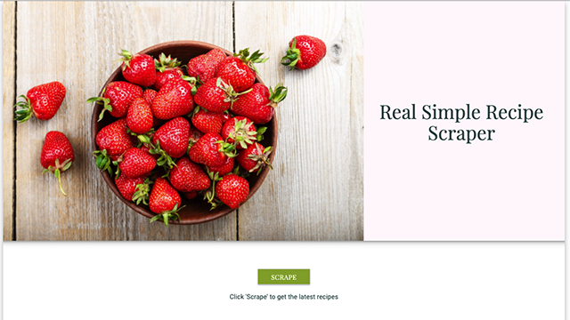

# Real Simple Recipe Scraper

This app scrapes the recipes from the 
[Real Simple Recipes](https://www.realsimple.com/food-recipes/browse-all-recipes) page.

You can save recipes, write notes on a saved recipe, delete a note from a saved recipe or delete a recipe from the saved recipes section.

### To begin, click on the SCRAPE button to get the latest Recipes from Real Simple

## Giphy Demo

## GO TO SITE

* [Real Simple Recipe Scraper](https://realsimplerecipescraper.herokuapp.com/)

## Built With

* [HTML](https://developer.mozilla.org/en-US/docs/Web/HTML)
* [CSS](https://developer.mozilla.org/en-US/docs/Web/CSS)
* [Javascript](https://developer.mozilla.org/en-US/docs/Web/JavaScript)
* [jQuery](https://developer.mozilla.org/en-US/docs/Glossary/jQuery)
* [Node.js / Express](https://developer.mozilla.org/en-US/docs/Learn/Server-side/Express_Nodejs)
* [Materialize](https://materializecss.com/)
* [Handlebars](https://handlebarsjs.com/)
* [Express](https://expressjs.com/)
* [Express-Handlebars](https://www.npmjs.com/package/express-handlebars)
* [Axios](https://www.npmjs.com/package/axios)
* [Cheerio](https://cheerio.js.org/)
* [Mongoose](https://mongoosejs.com/)
* [Morgan](https://www.npmjs.com/package/morgan)

## This project was created by:
* *Jennifer Kruk* - [github](https://github.com/jenkruk)

## License

This project is licensed under the MIT License
